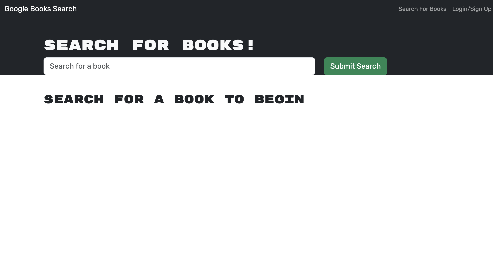
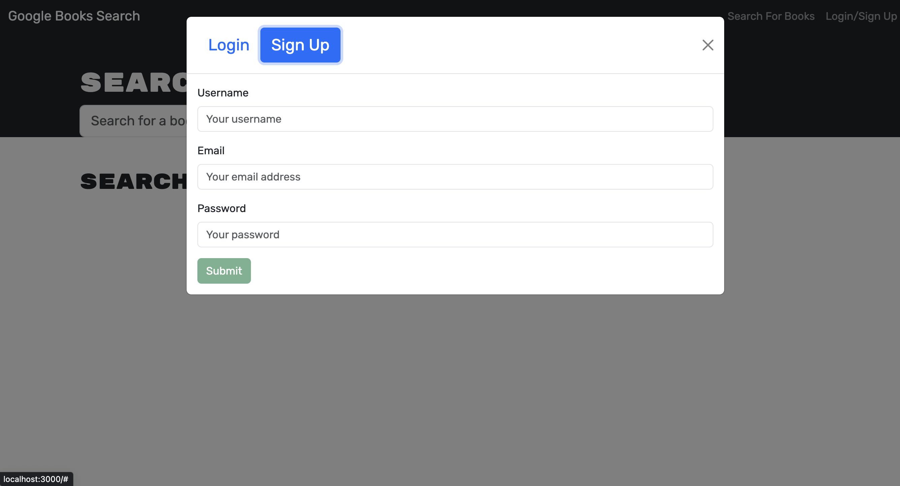
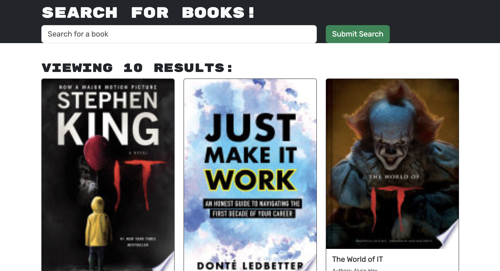

# Find-a-Book

    
<h2>Table of Contents</h2>

- [Find-a-Book](#find-a-book)
  - [Description](#description)
  - [License](#license)
  - [Technologies Used](#technologies-used)
  - [Screenshots](#screenshots)
  - [Deployed Application](#deployed-application)
  - [Acknowledgements](#acknowledgements)
  - [Contributors / Contact Info](#contributors--contact-info)

## Description

In this application we were given a functional restful api application and our task was to refactor it to be GraphQL API built with Apollo Server. I utilized the MERN Stack by using MongoDB for the database, Express.js and Node.js for the server and API, and React for the frontend. The functionality of the application is the ability for the user to create an account, search for books, and save the books for later.

## License

## Technologies Used

    
  

## Screenshots

Landing Page  Login Page  Signup Page  Search Results Page 

## Deployed Application

[Heroku link](https://vast-scrubland-90921-2deb99496272.herokuapp.com/) to application. (Unfortunately I was unable to ge the application to deploy properly. I even tried on another site but was not successful. Really wish I had more time. 😞 Error I kept getting was `MongooseServerSelectionError: connect ECONNREFUSED 127.0.0.1:27017` )

## Acknowledgements

Thank you to our instructor and all of the TA's for their ongoing support and expertise.

## Contributors / Contact Info

Jonathan Strickland [@JonJonS06](https://github.com/JonJonS06)

[🔼 Back to Top](#find-a-book)
